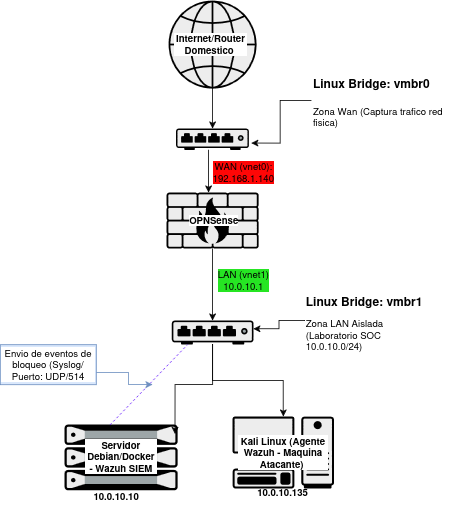
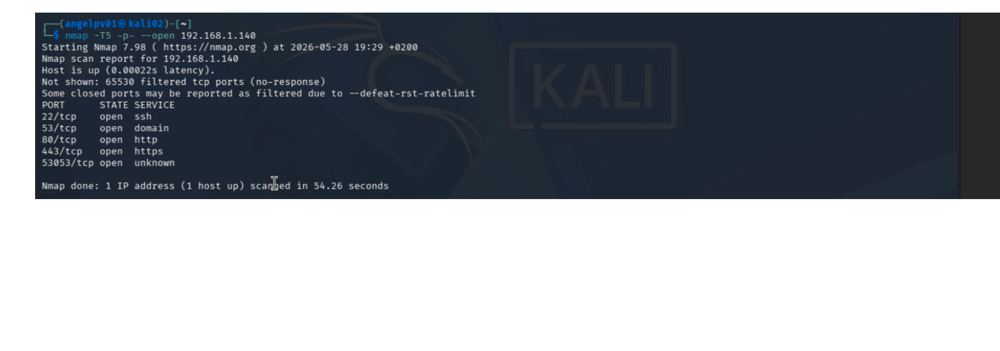
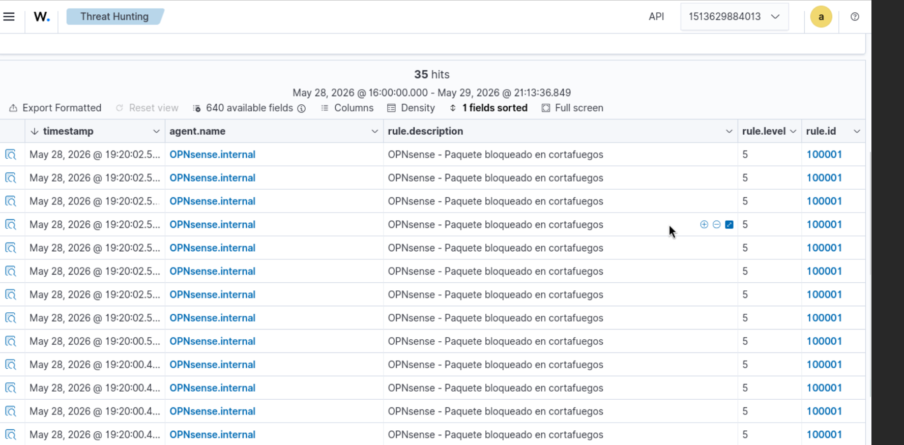
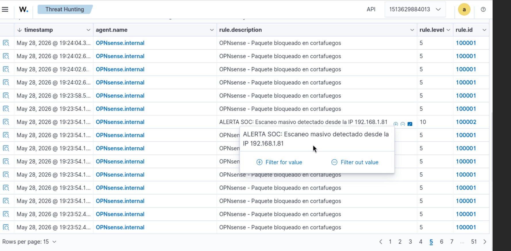
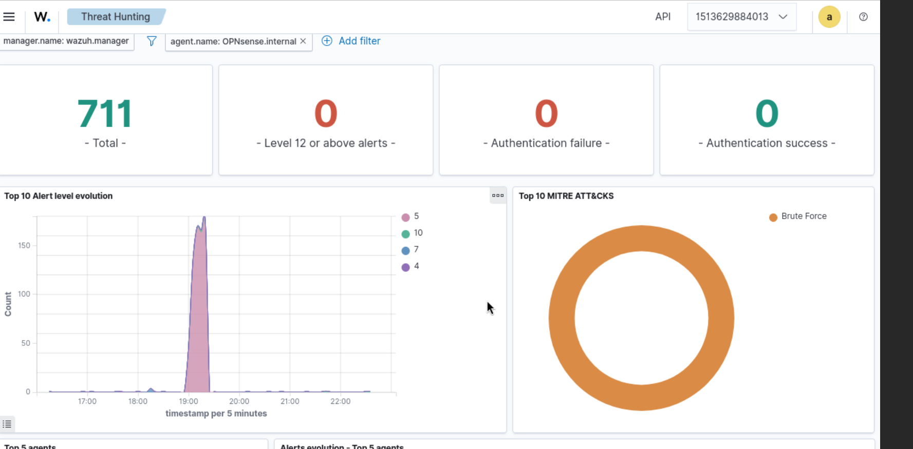
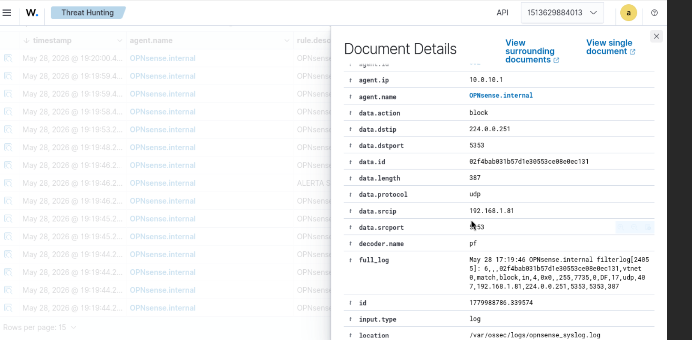
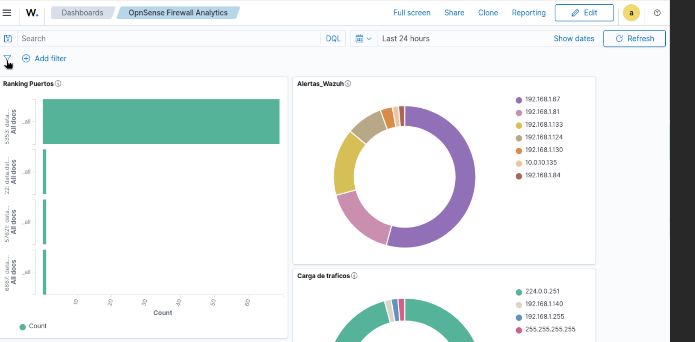

#  SOC-Wazuh_OPNsense_Lab

Despliegue de un entorno SIEM/SOC (Wazuh + Docker) con monitorización perimetral (OPNsense) en Proxmox VE. Incluye ruleset personalizado mapeado con el framework MITRE ATT&CK (T1110).

---

##  Arquitectura de Red y Topología de la Infraestructura

Para garantizar un aislamiento estricto y un control absoluto sobre el tráfico auditado, el entorno se ha consolidado sobre el hipervisor **Proxmox VE**, estructurando un flujo de tráfico vertical donde la seguridad perimetral controla las comunicaciones.



###  Desglose de Componentes y Direccionamiento

* **Puente Virtual `vmbr0` (Segmento WAN / Red Doméstica):** Vincula el entorno virtualizado con la red física (Subred `192.168.1.0/24`). La interfaz `WAN (vtnet0)` de OPNsense toma la IP **`192.168.1.140`** en este segmento.
* **Cortafuegos Perimetral (OPNsense 26.1):** Actúa como Gateway y frontera de seguridad. Aplica políticas de denegación por defecto (*Default Drop Rule*) e implementa el reenvío de logs vía Syslog. Su interfaz `LAN (vtnet1)` es la puerta de enlace segura: **`10.0.10.1`**.
* **Puente Virtual `vmbr1` (Segmento LAN Interno / Zona SOC):** Switch virtual aislado (`10.0.10.0/24`) que fuerza a que todo el tráfico pase por la inspección de OPNsense. Aquí conviven:
  * **Servidor Debian/Docker (`10.0.10.10`):** Aloja el stack completo del SIEM (Wazuh Manager, Indexer y Dashboard).
  * **Kali Linux VM (`10.0.10.135`):** Máquina encargada de ejecutar las pruebas de concepto (PoC) de escaneo masivo de puertos con herramientas como `nmap`.

---

## Decodificadores y Reglas Custom

### 1. Decodificador Personalizado (`local_decoder.xml`)
Debido a que los logs crudos del daemon `filterlog` de OPNsense viajan en formato plano separado por comas, se implementó un decodificador jerárquico de estructura Padre/Hijo que extrae mediante expresiones regulares (`regex`) y posiciones (`offsets`) las variables críticas necesarias para la monitorización:

```xml
<decoder name="opn-filter">
  <prematch>filterlog \d+ - [meta sequenceId="\d+"] </prematch>
</decoder>

<decoder name="opn-filter-fields">
  <parent>opn-filter</parent>
  <regex offset="after_parent">\S*,\S*,\S*,(\S*),(\S*),\S*,(\S*),</regex>
  <order>id,ifname,action</order>
</decoder>

<decoder name="opn-filter-fields">
  <parent>opn-filter</parent>
  <regex offset="after_regex">(\S*),\S*,\S*,\S*,\S*,\S*,\S*,\S*,\S*,(\S*),\S*,(\S*),(\S*),</regex>
  <order>direction,protocol,srcip,dstip</order>
</decoder>

<decoder name="opn-filter-fields">
  <parent>opn-filter</parent>
  <regex offset="after_regex">(\d*),(\d*),\S*</regex>
  <order>srcport,dstport</order>
</decoder>
```
## 2. Cómo funciona el decodificador principal (opn-filter)

Este es el decodificador "padre". Su único trabajo es vigilar todos los logs que entran a Wazuh y cazar únicamente los que vienen del cortafuegos OPNsense:

* **Filtro de entrada (<prematch>):** Busca que el log empiece exactamente con la estructura nativa del firewall (filterlog \d+ - [meta sequenceId="\d+"] ).

* **Utilidad:** Si el log no tiene esa cabecera, Wazuh pasa de él y no gasta tiempo procesándolo. Si coincide, le da el visto bueno y se lo pasa a los decodificadores hijos para que lo troceen.

## 3. Extracción de datos por fases (offsets)

En lugar de usar una sola expresión regular gigante para leer toda la línea del log (lo que consumiría demasiada CPU en el servidor), el trabajo se divide en tres decodificadores hijos que van leyendo el log por tramos, como una cadena de montaje:

 * **Fase A - Datos del Firewall (offset="after_parent"):** Empieza a leer justo donde terminó el decodificador padre. Va contando las comas del log de OPNsense y extrae tres datos básicos: la ID de la regla interna, el nombre de la interfaz de red   (ifname) y si el paquete se ha bloqueado o aceptado (action).

 * **Fase B - Direcciones IP y Protocolo (offset="after_regex"):**  Sigue leyendo desde donde se quedó el paso anterior. Salta los datos que no nos importan y guarda las variables clave: si el tráfico es entrante o saliente (direction), el protocolo (protocol), la IP de origen (srcip) y la IP de destino (dstip).

 * **Fase C - Puertos de conexión (offset="after_regex"):** Va al tramo final del log y busca caracteres numéricos para sacar los puertos exactos de origen (srcport) y destino (dstport). Estos datos son los que luego nos permiten pintar las gráficas en el panel.

## 4. Rules (local_rules.xml)

## Nota de Optimización de Rendimiento:
  * **Se ha implementado un árbol de decisión jerárquico de tres niveles para optimizar el rendimiento de la base de datos y proteger el almacenamiento del servidor.**
  * **Mediante el uso estratégico de la directiva <options>no_log</options> en la regla intermedia (100001), se evita que miles de alertas individuales de nivel 5 saturen el disco de forma innecesaria. El motor procesa estos eventos estrictamente en memoria para la lógica de ráfagas, reservando el almacenamiento físico y la representación visual en el Dashboard de Threat Hunting de forma exclusiva para los escenarios de alerta correlacionada de nivel crítico (Nivel 10), correspondientes a ataques de reconocimiento activos.**

```xml
<group name="opnsense-filter,">
  <rule id="100000" level="0">
    <decoded_as>opn-filter</decoded_as>
    <description>OPNsense filterlog rules grouped</description>
  </rule>
  
  <rule id="100001" level="5">
    <if_sid>100000</if_sid>
    <action>block</action>
    <options>no_log</options>
    <description>OPNsense firewall drop event</description>
    <group>firewall_block,pci_dss_1.4,nist_800_53_SC.7,</group>
  </rule>
  
  <rule id="100002" level="10" frequency="18" timeframe="45" ignore="240">
    <if_matched_sid>100001</if_matched_sid>
    <same_source_ip />
    <description>Multiple OPNsense firewall block events from the same IP address</description>
    <mitre>
      <id>T1110</id>
    </mitre>
    <group>multiple_blocks,pci_dss_10.6.1,nist_800_53_AU.6,</group>
  </rule>
</group>

```
## 5. Lógica de la regla de ráfagas (rule id="100002")

Esta regla es la que tiene la lógica inteligente para detectar el ataque y evitar que el Dashboard se sature de notificaciones repetidas:

  * **Vigilancia (<if_matched_sid>):** Está escuchando constantemente lo que hace la regla intermedia (100001), que es la que procesa los bloqueos individuales en silencio.

  * **Control por IP (<same_source_ip />):** Comprueba que los bloqueos vengan de la misma máquina. Si vinieran de IPs distintas, no saltaría la alerta.

  * **Cálculo del ataque (frequency="18" timeframe="45"):** Si una misma IP genera 18 o más bloqueos en una ventana de 45 segundos, el SIEM entiende que no es un fallo de conexión normal, sino un escaneo de puertos o un ataque automatizado, y eleva la alerta a Nivel 10 (Crítico).

  * **Anti-spam (ignore="240"):** Cuando la alerta salta en el Dashboard, la regla se "duerme" durante 4 minutos (240 segundos) para esa IP atacante. Así, si el escaneo de Kali sigue lanzando miles de paquetes, el servidor no se satura guardando la misma alerta una y otra vez, evitando llenar el disco duro y facilitando la lectura al analista.

##  Flujo de Validación y Prueba de Concepto (PoC)

Para auditar la robustez de la infraestructura y certificar el correcto funcionamiento del pipeline de telemetría y las rules de correlación, se ejecutó una simulación de ataque real siguiendo un flujo cronológico:

## 1. Fase de Ataque (Reconocimiento Activo)

Desde la máquina de auditoría Kali Linux (10.0.10.135), se lanzó un reconocimiento agresivo temporizado en modo insano (-T5) apuntando a la totalidad de los 65.535 puertos del cortafuegos para forzar una respuesta masiva del perímetro:

```BASH
sudo nmap -T5 -p- --open 192.168.1.140

```
Se adjunta la evidencia de la ejecución del comando ofensivo en la terminal del atacante:




## 2. Qué pasa dentro de Wazuh cuando llega el ataque

Cuando la Kali empieza a escanear a lo loco, el OPNsense no para de bloquear paquetes y mandar logs en texto plano hacia el puerto UDP/514 del servidor de Wazuh.

Aquí es donde se nota el trabajo de optimización que hicimos con las reglas. En esta captura de pantalla de la sección de Threat Hunting se puede ver perfectamente la "cola" o fila india de logs que van entrando. Todos entran con la regla intermedia (100001) y con Nivel 5 de severidad:



Como configuramos la directiva no_log, todos estos miles de impactos que veis en la fila se procesan directamente en la memoria del servidor. No se escriben en el disco duro para no llenarlo de basura ni saturar la base de datos con alertas repetidas de "paquete bloqueado".

## 3. El resultado final en el Dashboard del SOC

¿Cuándo vemos el aviso real? En cuanto el motor de Wazuh cuenta que una misma IP de origen (nuestra Kali) ha generado más de 18 bloqueos en menos de 45 segundos, la regla de correlación (100002) se activa automáticamente y salta la alerta gorda de Nivel 10 (Crítica).



Al meterle las etiquetas de seguridad en nuestro archivo de reglas, el incidente aparece ya masticado en el panel principal, clasificando el escaneo directamente dentro del mapa de MITRE ATT&CK bajo la técnica de Brute Force (Fuerza Bruta / Reconocimiento):



Además, en la gráfica de la izquierda se pueden ver perfectamente los picos de actividad que coinciden con los momentos exactos en los que lanzamos los comandos de nmap desde la máquina atacante. De esta forma, el analista del SOC puede ver el ataque de forma muy visual sin tener que estar leyendo miles de líneas de logs crudos.

## 🔍 Extra: El caso del tráfico mDNS (Ruido en la red de casa)

Mientras dejé el laboratorio encendido en modo de escucha pasiva, noté que la regla de ráfagas (`100002`) empezó a registrar picos de actividad extraños que no venían de la máquina de Kali Linux, sino de un dispositivo físico de mi propia casa (con la IP **`192.168.1.81`**):


Al revisar el detalle de la alerta, vi que este dispositivo estaba inundando la red con paquetes dirigidos al puerto **5353**:



**¿Qué estaba pasando realmente?** Este tráfico es totalmente normal en redes domésticas; es el protocolo **mDNS**, el que usan los móviles, teles inteligentes o impresoras para buscarse entre sí automáticamente dentro de casa. 

Como la interfaz WAN de mi cortafuegos está conectada al router de la vivienda, el OPNsense interceptó ese "ruido" de fondo, lo bloqueó por seguridad y se lo envió a Wazuh. Esto me sirvió como una prueba real perfecta para ver cómo el SIEM procesa el tráfico del día a día y cómo lo organiza visualmente en las gráficas de puertos más activos:




##  Referencias y Créditos

  *  Diseño del ruleset: La estructura inicial de las expresiones regulares para las tramas de OPNsense se adaptó y optimizó a partir de esquemas de código abierto compartidos por la comunidad de seguridad de Wazuh.

  *  Documentación Oficial: Consulta de sintaxis de directivas XML mediante la Guía de Usuario de Wazuh.


---


   
